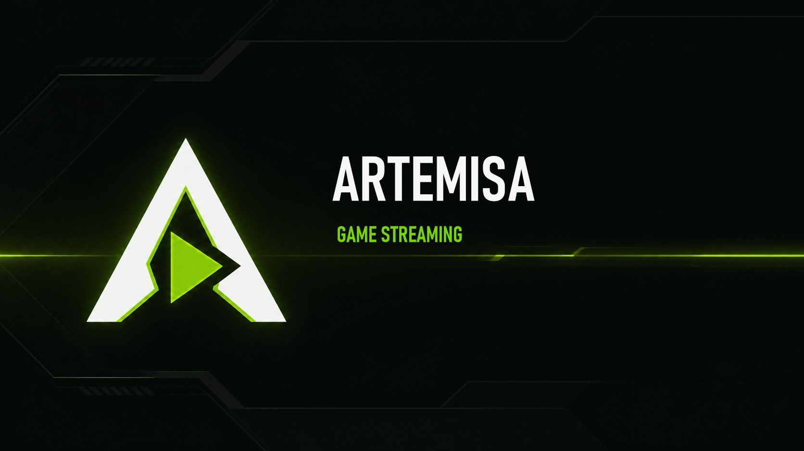
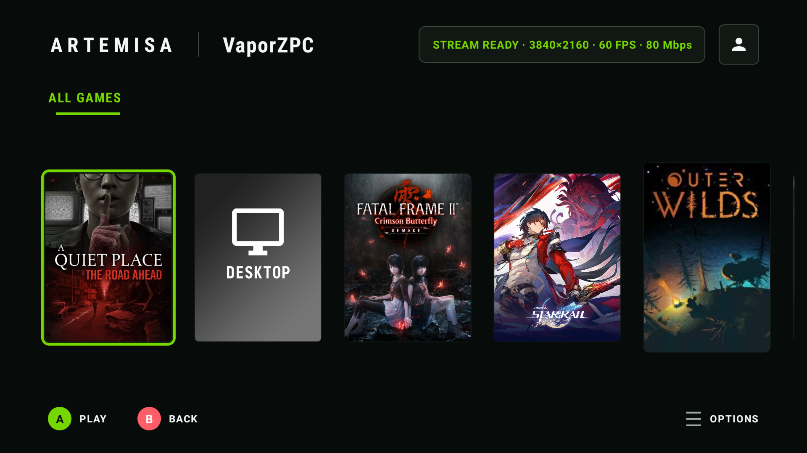
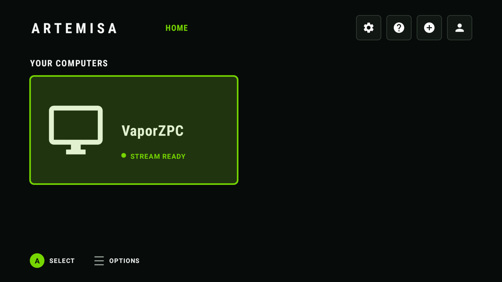
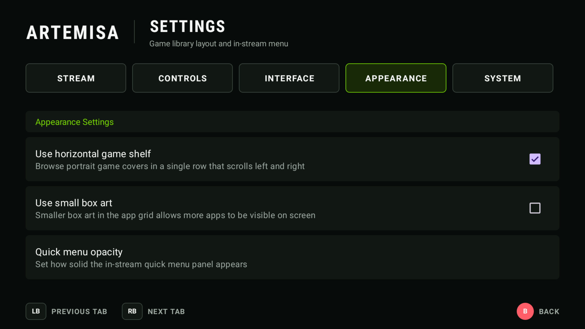
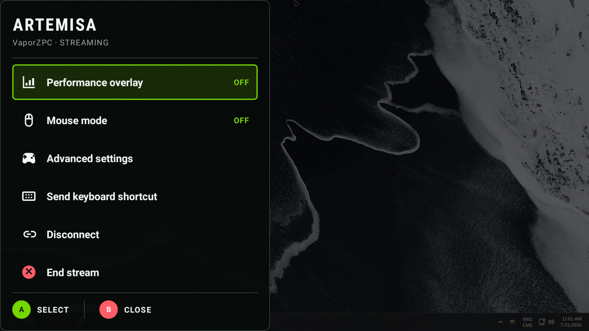
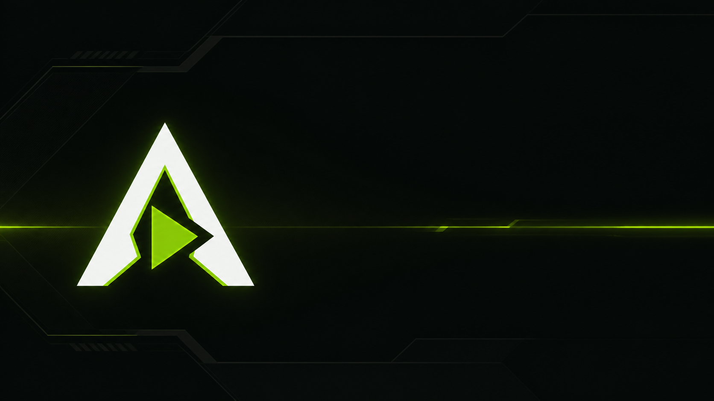

<div align="center">
  

  <h3>Controller-first game streaming, built for the couch.</h3>

  <p>
    A TV-focused Android client for streaming games from
    <a href="https://github.com/ClassicOldSong/Apollo">Apollo</a> or
    <a href="https://github.com/LizardByte/Sunshine">Sunshine</a>.
  </p>

  <p>
    <a href="https://github.com/BilodeauIsADev/Artemisa/releases"><strong>Downloads</strong></a>
    |
    <a href="#building"><strong>Build from source</strong></a>
    |
    <a href="#controller-guide"><strong>Controller guide</strong></a>
  </p>

  <p>
    
    
    
  </p>
</div>

## Made for a controller

Artemisa reshapes the familiar Moonlight streaming experience into a console-style interface for Android TV and NVIDIA Shield. The home screen, game library, settings, and in-stream quick menu are designed around predictable D-pad focus and comfortable viewing from across the room.

<a href="docs/screenshots/library.png">
  
</a>

<table>
  <tr>
    <td width="50%" align="center">
      <a href="docs/screenshots/home.png"></a>
      <br><sub><strong>Console-style home</strong></sub>
    </td>
    <td width="50%" align="center">
      <a href="docs/screenshots/appearance.png"></a>
      <br><sub><strong>TV-friendly settings</strong></sub>
    </td>
  </tr>
</table>

<a href="docs/screenshots/quick-menu.png">
  
</a>

## Highlights

- Console-style home and game library with clear, animated controller focus.
- Optional horizontal shelf for browsing portrait game covers left to right.
- Persistent in-stream quick menu with smooth submenu transitions and reliable back navigation.
- Quick access to performance overlays, mouse modes, advanced controls, keyboard shortcuts, disconnect, and End Stream.
- Appearance controls for the library layout, box-art density, and quick-menu opacity.
- Configurable frame pacing and optional low-latency frame rendering - settings remain under your control.
- Apollo virtual-display and server-command integration, custom resolutions and bitrates, HDR, surround audio, controller support, and the broader Artemis feature set.

## Controller guide

| Input | Action |
| --- | --- |
| D-pad | Move focus and browse games or settings |
| A | Select, play, or confirm |
| B | Go back without closing the current parent menu |
| Menu | Open options for the selected computer or game |
| Select + Start | Open the quick menu while streaming |

## Getting started

1. Install and configure [Apollo](https://github.com/ClassicOldSong/Apollo) or [Sunshine](https://github.com/LizardByte/Sunshine) on the host PC.
2. Install Artemisa on the Android device.
3. Add the host, pair with the PIN shown on the TV, and choose a game.

Apollo is recommended when you want automatic virtual-display handling and its extended host integrations.

## Building

### Requirements

- Android Studio with Android SDK 36
- Android NDK `27.0.12077973`
- A compatible JDK and the Android SDK path configured in `local.properties`

Clone the repository and initialize its submodules:

```bash
git clone --recurse-submodules https://github.com/BilodeauIsADev/Artemisa.git
cd Artemisa
```

Build the non-root game debug APK on Windows:

```powershell
.\gradlew.bat :app:assembleNonRoot_gameDebug
```

Or on macOS/Linux:

```bash
./gradlew :app:assembleNonRoot_gameDebug
```

The ABI-specific APKs are written to:

```text
app/build/outputs/apk/nonRoot_game/debug/
```

For an NVIDIA Shield, install the `arm64-v8a` APK:

```bash
adb install -r app/build/outputs/apk/nonRoot_game/debug/app-nonRoot_game-arm64-v8a-debug.apk
```

## Project lineage

Artemisa builds on [Artemis Android / Moonlight Noir](https://github.com/ClassicOldSong/moonlight-android), which is derived from [Moonlight Android](https://github.com/moonlight-stream/moonlight-android) and the [Moonlight Embedded Core](https://github.com/moonlight-stream/moonlight-common-c). Thanks to the upstream maintainers and contributors whose work makes this project possible.

## Brand assets

<div align="center">
  
  &nbsp;&nbsp;&nbsp;
  
</div>

Source-quality brand masters live in [`artwork/branding`](artwork/branding).

## License

Artemisa is free software released under the [GNU General Public License v3.0](LICENSE.txt).
